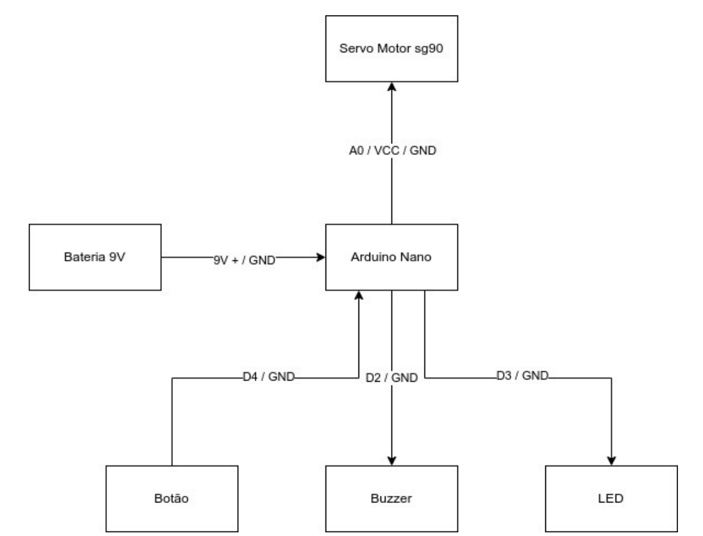
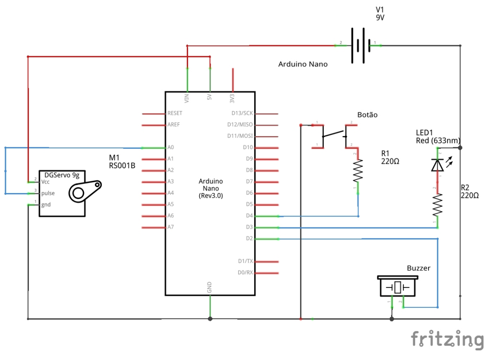
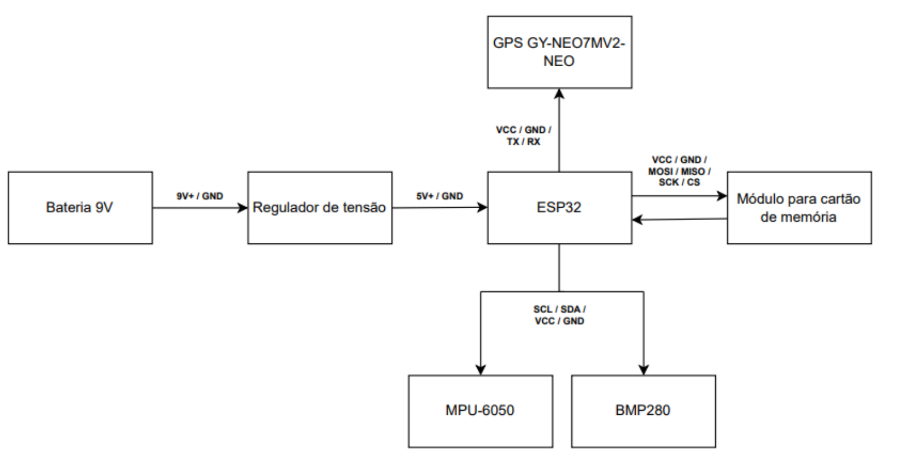
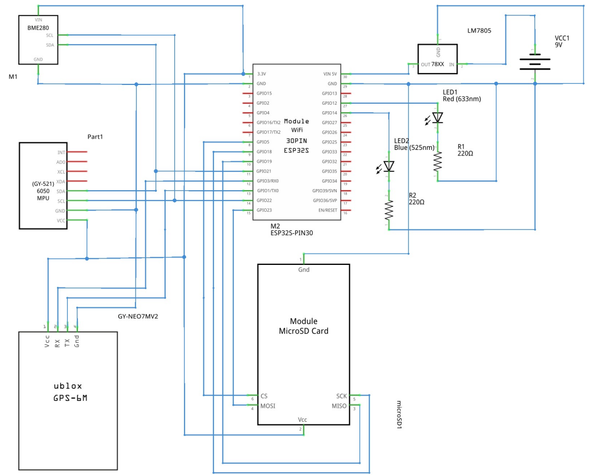

# pi1-eletronica
Este repositório contempla os códigos desenvolvidos durante a disciplina de Projeto Integrador 1 2025.1 (PI1) que dão suporte a todos os componentes do sistema eletrônico do projeto.

## Diagramas

### Base

#### 1. Blocos

#### 2. Esquemático

### Foguete

#### 1. Blocos

#### 2. Esquemático

